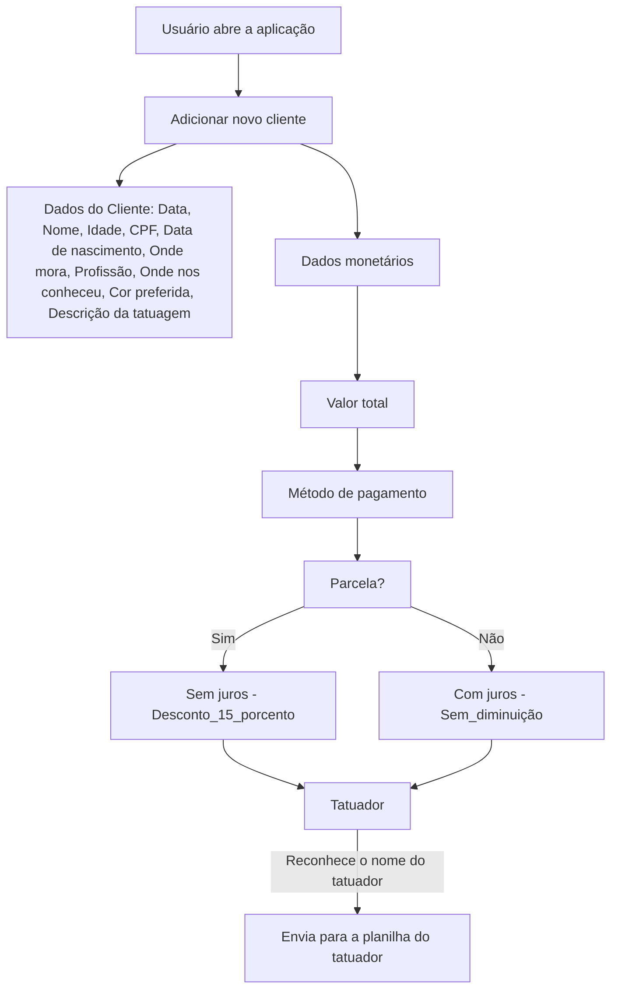

# Management-INK
## O Management INK é uma ideia de controle de dados de clientes e dados monetários a partir dos procedimentos feitos em um estúdio X.

Segue o fluxograma que mediará toda a aplicação a fim de chegar simplificação do processo de fichar o cliente.

