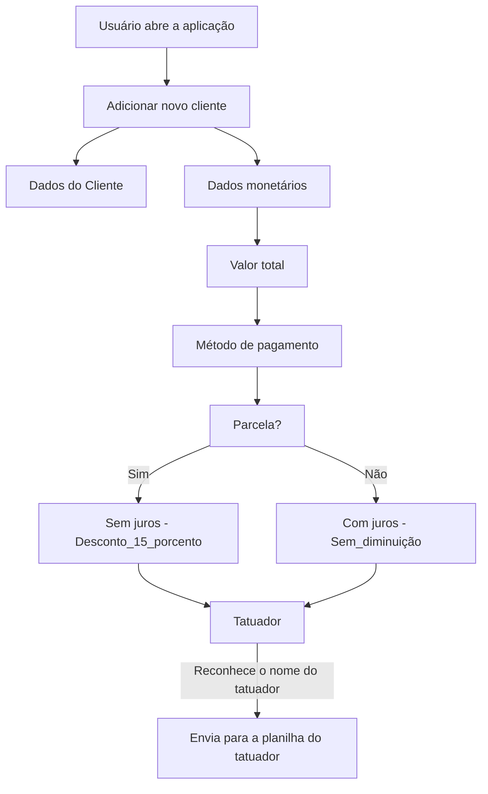

# Management-INK
## O Management INK é uma ideia de controle de dados de clientes e dados monetários a partir dos procedimentos feitos em um estúdio X.

Segue o fluxograma que mediará toda a aplicação a fim de chegar simplificação do processo de fichar o cliente.

## Quebrando um problema em vários.
### Tentando jogar os dados do cliente para um arquivo txt.

Bem, terminei meu módulo inicial de java ontem, não posso esperar que eu monte essa aplicação em um dia, portanto irei seguindo passos, primeiro vou montar um processo onde eu consiga pegar os dados desse cliente e os colocar em um arquivo txt.